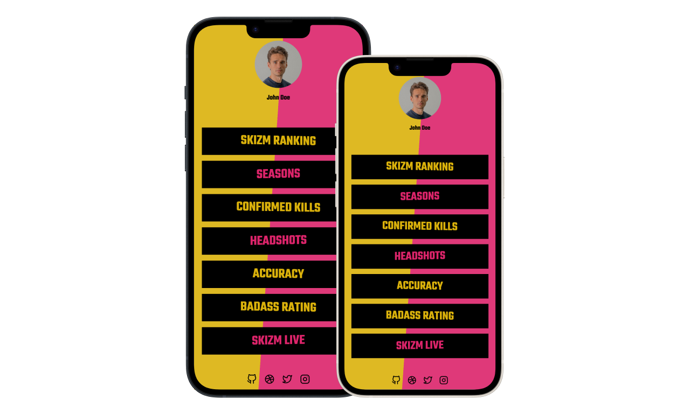

# Guns Akimbo Theme



### How to use this theme

1. First thing first fork the [Anker](https://github.com/ankerapp/anker-app) repository

2. Clone the forked repository
    ```bash
    git clone https://github.com/<your-username>/anker-app.git
    ```

3. Navigate to the themes directory
    ```bash
    cd anker-app/themes
    ```

4. Download the theme files with SVN. Run the following command
    ```bash
    svn export https://github.com/ankerapp/anker-themes/trunk/themes/guns-akimbo
    ```

5. Navigate back to anker-app and build the project
    ```bash
    cd ..
    make build
    ```
