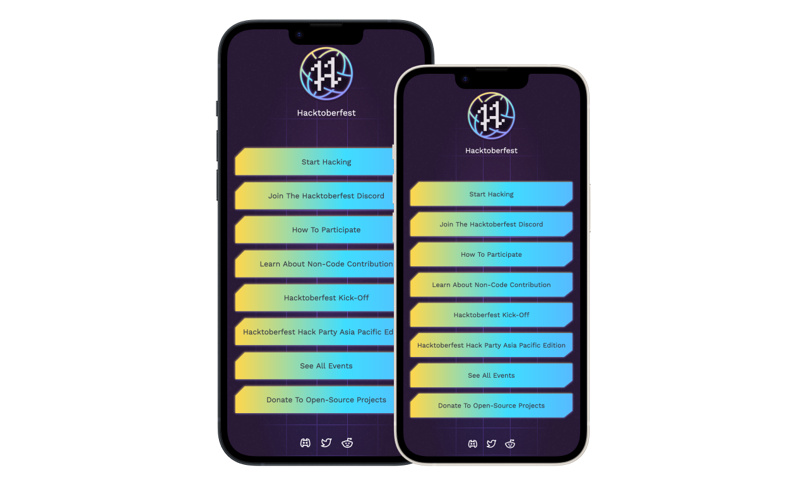

# Anker Hacktoberfest theme

> **Disclaimer** All the assets are the property of Digitalocean LLC. This theme
is created only for Demo purposes. DO NOT USE for personal or commercial purposes!



### Live Demo
[Click Here](https://hf22.netlify.app/) to see the live demo!

### How to use this theme

1. First thing first fork the [Anker](https://github.com/ankerapp/anker-app) repository

2. Clone the forked repository
    ```bash
    git clone https://github.com/<your-username>/anker-app.git
    ```

3. Navigate to the themes directory
    ```bash
    cd anker-app/themes
    ```

4. Download the theme files with SVN. Run the following command
    ```bash
    svn export https://github.com/ankerapp/anker-themes/trunk/themes/hacktoberfest-2022
    ```

5. Navigate back to anker-app and build the project
    ```bash
    cd ..
    make build
    ```
