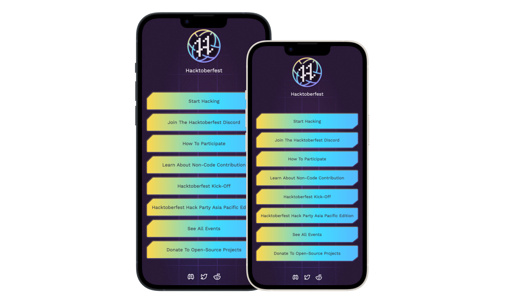

# Anker Hacktoberfest theme

> **Disclaimer** All the assets are the property of Digitalocean LLC. This theme
is created only for Demo purposes. DO NOT USE for personal or commercial purposes!

# Screenshots


### Live Demo
[Click Here](https://hf22.netlify.app/) to see the live demo!

### How to use this theme
This applies to all themes in `anker-themes` repository. To use the theme you
can either download the theme file manually which is `_hacktoberfest.scss` and
move it to `themes/` directory and add in `_index.scss` inside `themes/`
directory to be compiled.

The other solution is to navigate to `themes/` directory and use cURL to export
it directly from this repository like following:

```shell
curl https://raw.githubusercontent.com/ankerapp/anker-themes/master/hacktoberfest-2022/_hacktoberfest.scss >_hacktoberfest.scss
```
